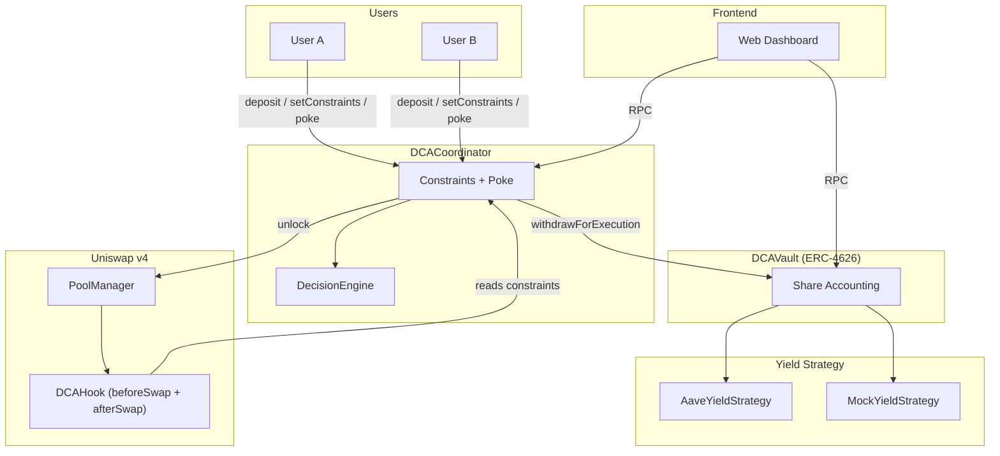

# CSI ORIGIN — Yield-Optimized DCA Engine via Uniswap v4 Hooks

> **CSI ORIGIN 2026 · Problem Statement 12**

An on-chain, multi-user Dollar-Cost Averaging protocol that keeps committed capital earning yield in an ERC-4626 vault between execution intervals, uses a deterministic decision engine to adapt execution to market conditions, and enforces per-user tranche and slippage limits through a custom Uniswap v4 Hook.

---

## Problem

Traditional DCA on-chain suffers from two compounding inefficiencies:

1. **Idle Capital Drag** — Token capital reserved for future DCA purchases sits unproductively in contracts, earning zero yield while waiting for the next execution interval.
2. **Blind Execution** — Fixed-schedule bots execute regardless of adverse market conditions (high volatility, poor liquidity, sandwich attacks), exposing users to unnecessary slippage and MEV extraction.

Existing solutions force users to choose between yield (lock funds in a lending protocol) and execution readiness (hold funds in a DCA contract). No protocol treats undeployed DCA capital as an actively managed, yield-bearing resource with market-aware execution.

---

## Solution

CSI ORIGIN is an autonomous capital-management layer, not a scheduled DCA bot. It solves both problems simultaneously:

- **Yield While Waiting** — User deposits are held in an ERC-4626 vault backed by Aave v3 (or a configurable yield strategy). Capital earns lending yield until the exact block it is pulled for a swap.
- **Market-Aware Execution** — A deterministic Decision Engine evaluates price deviation against each user's personal bounds and outputs one of three actions: `EXECUTE_FULL`, `EXECUTE_PARTIAL`, or `DELAY`. Bad market conditions are skipped; urgency overrides prevent indefinite deferral.
- **Atomic On-Chain Protection** — A Uniswap v4 Hook enforces per-user tranche caps and slippage limits at the pool level. If any bound is breached, the entire transaction reverts atomically, leaving vault funds untouched.

---

## Key Features

### Core Features (Implemented)

| # | Feature | Description |
|---|---------|-------------|
| 1 | **ERC-4626 Yield Vault** | Tokenized vault that routes all deposits to a yield strategy. Zero idle USDC held in the vault contract itself. |
| 2 | **Per-User Bounded Constraints** | Each user independently configures: frequency, max delay, good/bad deviation thresholds, tranche size, flex range, and max slippage. Fully isolated storage. |
| 3 | **Deterministic Decision Engine** | Pure, stateless Solidity library. Three-band evaluation with linear interpolation in the middle band and urgency override at deadline. Same inputs always produce same outputs. |
| 4 | **Atomic Coordinator** | Orchestrates the withdraw-and-swap cycle through Uniswap v4's `unlock`/`unlockCallback` pattern. If any step fails, the entire transaction reverts. |
| 5 | **Uniswap v4 Hook** | `beforeSwap` enforces tranche caps; `afterSwap` enforces slippage limits. Reads constraints from trusted on-chain storage — never trusts caller-supplied data. |
| 6 | **Permissionless Poke** | Anyone can trigger evaluation for any user. Ineligible calls are clean no-ops (no revert, no gas waste). Protected by `ReentrancyGuard` against double-poke races. |
| 7 | **Multi-User Isolation** | All state is keyed per-address. One user's execution never affects another user's shares, constraints, or decisions. |

### Supporting Features (Implemented)

| Feature | Description |
|---------|-------------|
| **Web Dashboard** | Responsive single-page UI showing both users' positions, constraints, decisions, and poke actions in real time. |
| **Aave v3 Yield Strategy** | Production yield backend wrapping Aave v3 `supply`/`withdraw` on Base mainnet. |
| **Mock Yield Strategy** | Deterministic linear APR accrual (5% default) for testing without a live fork. |
| **Deployment Scripts** | `Deploy.s.sol` (full stack), `DeployFrontend.s.sol` (standalone demo mode), `SeedPool.s.sol` (liquidity seeding). |
| **Verification Scripts** | `task4_determinism.js` (determinism proof via snapshot/revert), `DemoVerification.s.sol` (live poke rehearsal). |

---

## How It Works

```
User A / User B
     │
     ├── deposit(USDC) ────────────────────► DCAVault (ERC-4626)
     │                                            │
     │                                      routes to strategy
     │                                            │
     │                                            ▼
     │                                     IYieldStrategy
     │                                  ┌─────────┴─────────┐
     │                                  ▼                   ▼
     │                         AaveYieldStrategy    MockYieldStrategy
     │                         (Aave v3 lending)    (linear APR mock)
     │
     ├── setConstraints(c) ────────────────► DCACoordinator
     │                                            │
     └── [anyone] poke(user) ──────────────┤
                                                  │
                                    _isEligible(user)?
                                          │
                                        yes
                                          │
                               ┌──────────┴──────────┐
                               │  _computeDeviationBps()
                               │  (reads Uniswap v4 sqrtPriceX96
                               │   via StateLibrary.getSlot0)
                               │
                               │  DecisionEngine.decide()
                               │  (deviationBps, daysUntilDeadline, c)
                               └──────────┬──────────┘
                                          │
                          ┌───────────────┼───────────────┐
                          ▼               ▼               ▼
                        DELAY        EXECUTE_         EXECUTE_
                       (no-op)       PARTIAL            FULL
                                          │               │
                                    compute tranche amount
                                          │
                                  vault.withdrawForExecution()
                                          │
                                  PoolManager.unlock()
                                    → unlockCallback()
                                    → swap via pool
                                    → DCAHook.beforeSwap: tranche cap
                                    → DCAHook.afterSwap:  slippage cap
                                    → settle flash accounting
```

### Decision Engine Bands

```
                          |deviationBps|
       0%              goodDev (1%)           badDev (3%)
       ├───────────────────┼───────────────────┼──────────────────►
       │    EXECUTE_FULL   │  EXECUTE_PARTIAL  │      DELAY
       │    (100% tranche) │  (50–100%, linear │  (0%, skip — unless
       │                   │   interpolation)  │   urgency override)
```

- **Deadline Override:** If `daysUntilDeadline ≤ 0`, always `EXECUTE_FULL` — the system never delays indefinitely.
- **Urgency Override:** If `daysUntilDeadline ≤ 1` and market is bad, forces `EXECUTE_PARTIAL` at minimum flex.

---

## Architecture



---

## Technology Stack

| Layer | Technology |
|-------|------------|
| **Smart Contracts** | Solidity `^0.8.26` |
| **Development Framework** | Foundry v1.8.0 (`forge`, `cast`, `anvil`) |
| **Vault Standard** | ERC-4626 (OpenZeppelin Contracts v5.7.0) |
| **Yield Source** | Aave v3 on Base Mainnet (production) / MockYieldStrategy (demo) |
| **Swap Execution** | Uniswap v4 (`@uniswap/v4-core` — PoolManager + Hooks) |
| **Target Network** | Base Mainnet (Chain ID 8453) — local Anvil fork for demo |
| **Frontend** | Vanilla HTML5 / CSS3 / JavaScript (ES6+) |
| **Web3 Library** | Ethers.js v6.13.1 |
| **Frontend Server** | Node.js (minimal static file server) |

---

## Test Suite

**114 tests passing, 0 failing, 0 skipped.**

```bash
forge test    # runs all suites
```

| Suite | Tests | Description |
|-------|-------|-------------|
| `DCAVaultTest` | 22 | ERC-4626 deposit/withdraw/yield/multi-user isolation |
| `DCACoordinatorTest` | 36 | Constraints validation, eligibility, all decision branches, vault integration, multi-user, double-poke race |
| `DecisionEngineTest` | 12 | All formula branches + 2 fuzz runs (256 iterations each) |
| `DCAHookTest` | 30 | Trust model, tranche cap enforcement, slippage cap, atomicity, user isolation |
| `IntegrationTest` | 13 | End-to-end 2-user flows: deposit, poke, decision, execution, hook rejection, snapshot/revert determinism |
| `LiveAaveForkTest` | 1 | Live Aave v3 deposit and `totalAssets()` verification on Base fork |

### Key Test Coverage

- **Double-poke race condition** (`test_doublePoke_race_isNoOp`) — second concurrent poke is a safe no-op
- **Hook rejection atomicity** (`test_hookRejects_vaultUntouched`) — vault shares unchanged after hook revert
- **Ineligible poke** (`test_poke_ineligible_isNoOp`) — no state mutation, no revert, no wasted gas
- **Decision determinism** (`testFuzz_decide_isDeterministic`) — 256 fuzz iterations confirm identical outputs for identical inputs
- **User isolation** — constraints, shares, and decisions are fully independent across users

---

## Project Structure

```
src/
├── core/
│   ├── DCAVault.sol              ERC-4626 per-user yield vault
│   ├── DCACoordinator.sol        Constraints, poke, decision + execution orchestration
│   └── DCAHook.sol               Uniswap v4 hook (beforeSwap + afterSwap enforcement)
├── interfaces/
│   ├── IDCACoordinator.sol       Coordinator interface + Constraints struct
│   └── IYieldStrategy.sol        Yield backend interface
├── libraries/
│   └── DecisionEngine.sol        Pure deterministic decision library
├── strategies/
│   ├── AaveYieldStrategy.sol     Aave v3 yield wrapper (production)
│   └── MockYieldStrategy.sol     Linear APR mock (test/demo)
└── mocks/
    ├── MockERC20.sol             Mintable ERC-20 for demo
    └── MockIntegrationPoolManager.sol  Stub PoolManager for unit tests

test/
├── DCAVault.t.sol                22 vault unit tests
├── DCACoordinator.t.sol          36 coordinator + decision tests
├── DecisionEngine.t.sol          12 pure library tests (incl. 2 fuzz)
├── DCAHook.t.sol                 30 hook enforcement + atomicity tests
├── Integration.t.sol             13 end-to-end integration tests
├── LiveAaveFork.t.sol            1 live Aave v3 fork test
└── ForkTestBase.sol              Shared Base fork setup + wallet funding

script/
├── Deploy.s.sol                  Full-stack deployment
├── DeployFrontend.s.sol          Standalone demo deployment (no Hook)
├── SeedPool.s.sol                Pool initialization + liquidity seeding
├── MoveMarket.s.sol              Demo market state control
├── DemoVerification.s.sol        Live poke rehearsal script
├── LiveDemoRehearsal.s.sol       On-chain MoveMarket + Hook rejection demo
├── task4_determinism.js          Node.js determinism proof (snapshot/revert)
├── start-fork.sh                 Anvil fork startup
└── fund-demo-wallets.sh          Wallet funding via impersonation

frontend/
├── index.html                    Single-page responsive dashboard
├── style.css                     Dark-mode glassmorphism UI
├── app.js                        Web3 interaction logic (ethers.js v6)
├── abi.js                        Contract ABI definitions
├── config.js                     Deployed contract addresses
├── server.js                     Minimal Node.js static server
└── test-e2e.js                   8 end-to-end frontend integration tests

docs/
├── Project Context.md            Problem statement analysis + domain framing
├── Technical Architecture.md     Full architecture spec + engineering handoff
├── Interface Contracts.md        Frozen interface definitions + invariants
└── Features of the Product       Product requirements + feature triage
```

---

## Getting Started

### Prerequisites

- [Foundry](https://getfoundry.sh/) v1.8.0+ (`forge`, `anvil`, `cast`)
- [Node.js](https://nodejs.org/) v18+ (for frontend server and verification scripts)
- Git

### Install

```bash
git clone https://github.com/iamRaz-01/VIT-CSI-ORIGIN.git
cd VIT-CSI-ORIGIN

# Solidity dependencies are committed in lib/ — no forge install needed
# Install frontend dependencies
cd frontend && npm install && cd ..
```

### Environment Setup

```bash
cp .env.example .env
```

Edit `.env`:

| Variable | Description | Default |
|----------|-------------|---------|
| `BASE_RPC_URL` | Base mainnet RPC endpoint | `https://mainnet.base.org` |
| `FORK_BLOCK_NUMBER` | Pinned block for deterministic fork | `50562708` |
| `DEPLOYER_PRIVATE_KEY` | Anvil default account #0 key | Pre-filled for local dev |
| `USDC_ADDRESS` | Base mainnet USDC | `0x833589fCD6eDb6E08f4c7C32D4f71b54bdA02913` |
| `AAVE_POOL_ADDRESS` | Aave v3 Pool on Base | `0xA238Dd80C259a72e81d7e4664a9801593F98d1c5` |
| `POOL_MANAGER_ADDRESS` | Uniswap v4 PoolManager on Base | `0x498581ff718922c3f8e6a244956af099b2652b2b` |

> **Note:** Never use the default Anvil keys with real funds. They are for local development only.

### Build & Test

```bash
# Compile all contracts
forge build

# Run the full 114-test suite
forge test

# Run specific suites
forge test --match-contract DCAVaultTest         # 22 vault tests
forge test --match-contract DCACoordinatorTest   # 36 coordinator tests
forge test --match-contract DecisionEngineTest   # 12 decision engine tests
forge test --match-contract DCAHookTest          # 30 hook tests
forge test --match-contract IntegrationTest      # 13 integration tests
```

---

## Running the Demo

### 1. Start the Anvil Fork

```bash
anvil --fork-url https://mainnet.base.org --fork-block-number 50562708 --code-size-limit 40000 --port 8545
```

### 2. Deploy Contracts

```bash
# Full stack (with Hook):
forge script script/Deploy.s.sol --rpc-url http://127.0.0.1:8545 --broadcast --private-key $DEPLOYER_PRIVATE_KEY -vvvv

# Or standalone demo mode (without Hook — simpler):
forge script script/DeployFrontend.s.sol --rpc-url http://127.0.0.1:8545 --broadcast --private-key $DEPLOYER_PRIVATE_KEY -vvvv
```

### 3. Start the Frontend

```bash
node frontend/server.js
```

Open `http://localhost:3000` in your browser.

### 4. Interact

- **Deposit USDC** into the vault for User A or User B
- **Set Constraints** (frequency, deviation bounds, tranche size, slippage)
- **Trigger Poke** to execute the DCA decision engine
- **Observe** the decision result (`EXECUTE_FULL`, `EXECUTE_PARTIAL`, or `DELAY`) and vault balance changes

### 5. Run Verification Scripts

```bash
# Determinism proof (snapshot → run → revert → run → compare)
node script/task4_determinism.js

# Frontend end-to-end tests (8 tests)
node frontend/test-e2e.js
```

---

## User Constraints

Each user independently configures their DCA behaviour via the `Constraints` struct:

| Parameter | Type | Purpose |
|-----------|------|---------|
| `minFrequencyDays` | `uint64` | Minimum interval between poke executions |
| `maxDelayDays` | `uint64` | Hard ceiling — system must execute before this elapses |
| `goodDeviationBps` | `uint16` | Deviation ≤ this → `EXECUTE_FULL` |
| `badDeviationBps` | `uint16` | Deviation ≥ this → `DELAY` (unless urgency override fires) |
| `trancheFlexMinBps` | `uint16` | Minimum execution size as fraction of standard tranche (bps) |
| `trancheFlexMaxBps` | `uint16` | Maximum execution size as fraction of standard tranche (bps) |
| `standardTrancheAmount` | `uint256` | Full tranche in USDC (6-decimal units) |
| `maxSlippageBps` | `uint16` | Slippage cap enforced by DCAHook at swap time (max 2000 bps) |

Constraints are stored per `msg.sender`. No user can modify another user's parameters.

---

## Validated Results

| Metric | Result |
|--------|--------|
| **Test Suite** | 114/114 passing (0 failures, 0 skipped) |
| **Decision Determinism** | Verified: identical inputs produce identical outputs across snapshot/revert cycles |
| **User Isolation** | Verified: User A's poke does not mutate User B's shares, constraints, or decisions |
| **Hook Atomicity** | Verified: tranche cap and slippage cap breaches revert cleanly with zero vault state change |
| **Double-Poke Safety** | Verified: concurrent poke is a safe no-op |
| **Aave v3 Integration** | Verified: live `deposit()` → `totalAssets()` on Base mainnet fork |
| **Frontend E2E** | 8/8 end-to-end tests passing (deposit, constraints, poke, isolation) |

---

## Limitations

| Item | Status | Notes |
|------|--------|-------|
| Live market deviation | Implemented in contract; returns `0` in standalone demo mode (no pool key set) | Full deviation requires `Deploy.s.sol` with an active Uniswap v4 pool |
| Hook address mining | CREATE2 salt is environment-sensitive | Works in test suite; `DeployFrontend.s.sol` skips the hook for demo stability |
| Public testnet deployment | Not deployed | Contracts are mainnet-ready; deployment requires funded wallet + real gas |
| Keeper automation | Not implemented | `poke()` is permissionless; integration with Chainlink/Gelato is a future step |

---

## Design Decisions

**Why ERC-4626?** Standardised vault interface allows yield strategies to be swapped without changing the vault's public API or affecting share accounting. OpenZeppelin's implementation provides built-in inflation-attack protection.

**Why a pure `library` for decision logic?** `DecisionEngine` being `internal pure` means it can be unit-tested exhaustively with zero mocking, its output is auditable from source code alone, and it adds no gas overhead from external calls.

**Why a clean no-op for ineligible poke?** Any revert-on-ineligible design forces keepers to pre-check eligibility off-chain before triggering, creating a race condition. A silent no-op makes the function safe to call from any automation without coordination overhead.

**Why does the Hook never trust hookData for numeric values?** Bounds are always re-read from `DCACoordinator.getConstraints(user)` — trusted on-chain storage. The `hookData` carries only the user's address identity. This closes the gap between decision-time and settlement-time constraints.

---

## License

MIT
